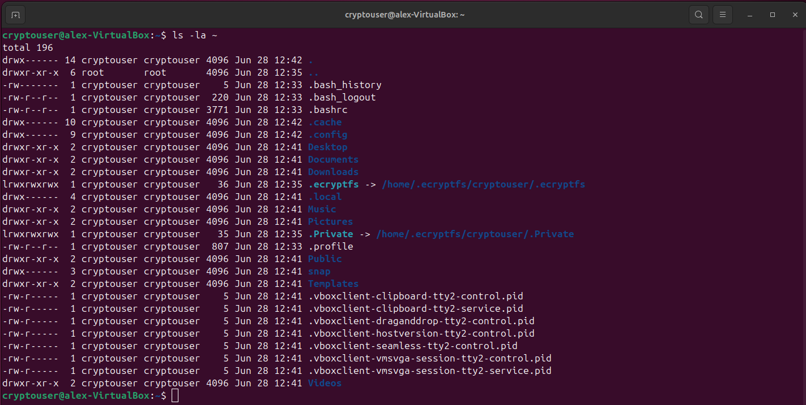
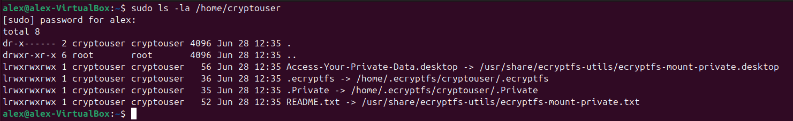
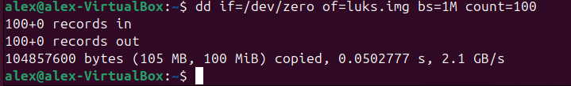
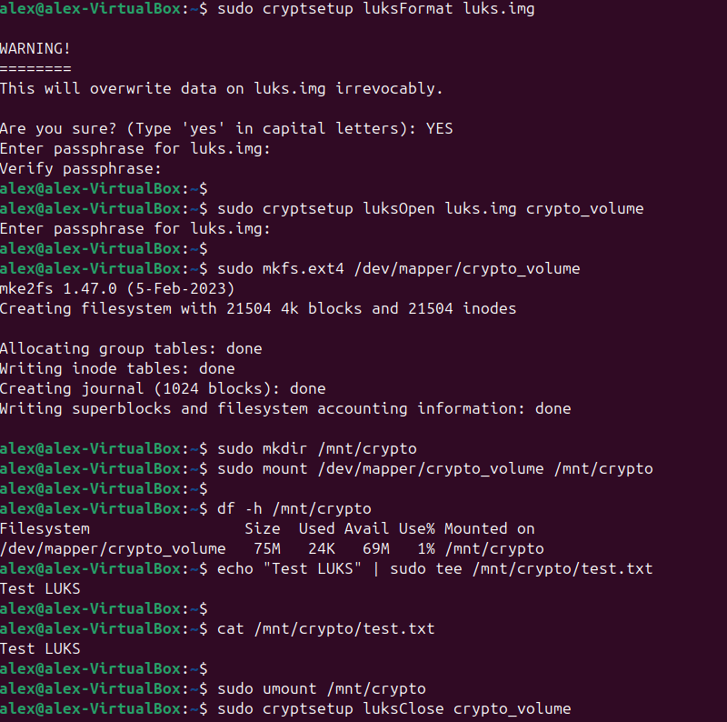

# Домашнее задание к занятию "`Защита хоста`" - `Некрасов Александр`

---

### Задание 1


1. Установите eCryptfs.
2. Добавьте пользователя cryptouser.
3. Зашифруйте домашний каталог пользователя с помощью eCryptfs.

_В качестве ответа пришлите снимки экрана домашнего каталога пользователя с исходными и зашифрованными данными._

### Решение 1

```
sudo apt update
sudo apt install ecryptfs-utils -y
sudo adduser cryptouser
sudo su - cryptouser
exit
sudo ecryptfs-migrate-home -u cryptouser
sudo reboot
```






---

### Задание 2

1. Установите поддержку LUKS.
2. Создайте небольшой раздел, например, 100 Мб.
3. Зашифруйте созданный раздел с помощью LUKS.

_В качестве ответа пришлите снимки экрана с поэтапным выполнением задания._

### Решение 2

```
sudo apt install cryptsetup -y
dd if=/dev/zero of=luks.img bs=1M count=100
sudo cryptsetup luksFormat luks.img

sudo cryptsetup luksOpen luks.img crypto_volume

sudo mkfs.ext4 /dev/mapper/crypto_volume
sudo mkdir /mnt/crypto
sudo mount /dev/mapper/crypto_volume /mnt/crypto

df -h /mnt/crypto

echo "Test LUKS" | sudo tee /mnt/crypto/test.txt

cat /mnt/crypto/test.txt

sudo umount /mnt/crypto
sudo cryptsetup luksClose crypto_volume

```





---
